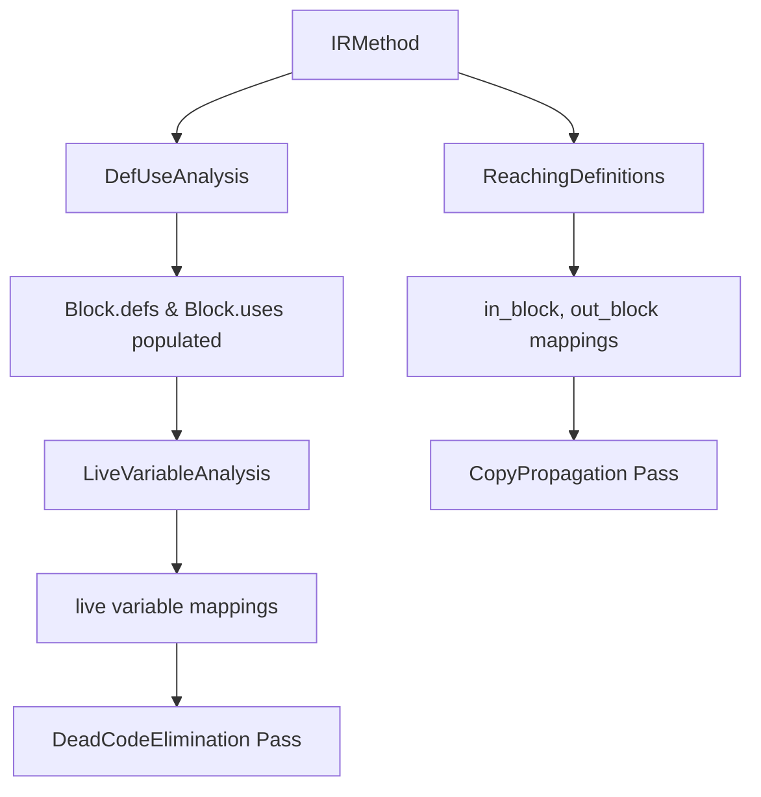

# Dataflow Analysis Module - Input/Output Summary

## Quick Reference

The dataflow analysis module in dayu processes Intermediate Representation (IR) code through three main analysis passes. Here's a concise summary of their inputs and outputs:

## Analysis Passes Overview

| Pass | Input | Output | Purpose |
|------|-------|--------|---------|
| **DefUseAnalysis** | IRMethod with CFG | Block.defs, Block.uses sets | Identify variables defined/used per block |
| **ReachingDefinitions** | IRMethod with CFG | (in_block, out_block) dicts | Track which definitions reach each point |
| **LiveVariableAnalysis** | IRMethod with defs/uses | (in_block, out_block) dicts | Identify live variables at each point |

## Example Analysis Results

Given this simple method:
```
Block 0: v0 = 5; v1 = v0
Block 1: v2 = v1 + 10; if v2 > 15 jump Block3  
Block 2: v1 = 20; jump Block3
Block 3: return v1
```

### 1. DefUse Analysis Results
```
Block 0: DEFS=[v0, v1]     USES=[5]
Block 1: DEFS=[v2]         USES=[v1, 10, 15, label_block3]  
Block 2: DEFS=[v1]         USES=[20, label_block3]
Block 3: DEFS=[]           USES=[v1]
```

### 2. Reaching Definitions Results
```
Block 0: IN=[]                          OUT=[v0=5, v1=v0]
Block 1: IN=[v0=5, v1=v0]              OUT=[v2=v1+10, v0=5, v1=v0]
Block 2: IN=[v2=v1+10, v0=5, v1=v0]    OUT=[v2=v1+10, v1=20, v0=5]
Block 3: IN=[v1=20, v0=5, v1=v0, v2=v1+10]  OUT=[v2=v1+10, v1=20, v0=5, v1=v0]
```

### 3. Live Variable Analysis Results  
```
Block 0: IN=[constants...]  OUT=[v1, constants...]
Block 1: IN=[v1, constants...] OUT=[v1, constants...]
Block 2: IN=[constants...]     OUT=[v1]
Block 3: IN=[v1]               OUT=[]
```

## Key Data Flow



## Input Data Structures

### IRMethod
- `blocks: List[IRBlock]` - Basic blocks
- `name: str` - Method identifier

### IRBlock  
- `insns: List[NAddressCode]` - Instructions
- `predecessors/successors: List[IRBlock]` - CFG edges
- `defs/uses: set` - Populated by DefUseAnalysis

### NAddressCode
- `type: NAddressCodeType` - Instruction type (ASSIGN, CALL, JUMP, etc.)
- `args: List` - Operands (variables, constants, labels)
- `op: str` - Operation ('+', '==', 'call', etc.)

## Output Data Structures

### DefUseAnalysis
- **Side Effect**: Populates `block.defs` and `block.uses` sets
- **defs**: Variables assigned in the block
- **uses**: Variables read before assignment in the block

### ReachingDefinitions  
- **Returns**: `(in_block: Dict[IRBlock, Set], out_block: Dict[IRBlock, Set])`
- **in_block[B]**: Definitions that reach the entry of block B
- **out_block[B]**: Definitions that reach the exit of block B

### LiveVariableAnalysis
- **Returns**: `(in_block: Dict[IRBlock, Set], out_block: Dict[IRBlock, Set])`  
- **in_block[B]**: Variables live at entry of block B
- **out_block[B]**: Variables live at exit of block B

## Integration Points

1. **LLIR Level**: All three analyses run to populate basic dataflow information
2. **MLIR/HLIR Levels**: Analyses re-run before optimization passes
3. **CopyPropagation**: Uses reaching definitions to safely replace variables
4. **DeadCodeElimination**: Uses live variables to remove unused assignments

## Variable Types Handled

- **Registers**: `v0`, `v1`, `acc` (PandasmInsnArgument)
- **Constants**: Immediate values, strings, labels
- **Complex Expressions**: Array accesses, property accesses (ExprArg)
- **Reference Objects**: Base objects for array/property operations

## Performance Notes

- **Complexity**: O(Variables × CFG Edges) per analysis
- **Convergence**: Usually 2-3 iterations for typical methods
- **Memory**: O(Variables × Basic Blocks) for result storage